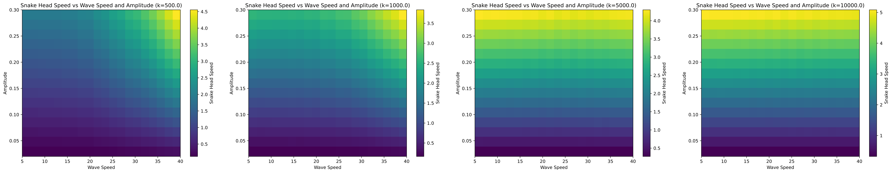

# Snake-Locomotion-Simulation
Incremental Potential | Mass Spring System | Snake Locomotion

- Developed a physics-based simulation of snake motion using a spring-mass system, with incremental potential energy for modeling muscle contractions and inter-particle dynamics. Visualized the relationship between parameters and locomotion speed, and created an demo to showcase results.
-  Implemented a custom traveling compression sine-wave to simulate muscle contractions, combined with directional friction to achieve snake locomotion. Enabled the simulation of two distinct movement patterns—rectilinear progression and horizontal undulatory progression—by adjusting the phase difference between the left-side and right-side waves.

## Result

### Parameter relationship

### Demo

###### Rectilinear

###### Undolatory

